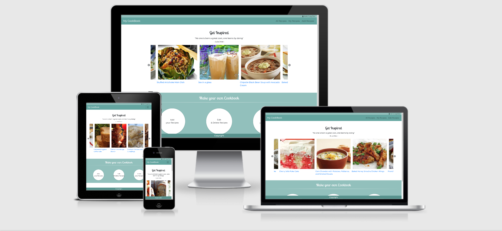
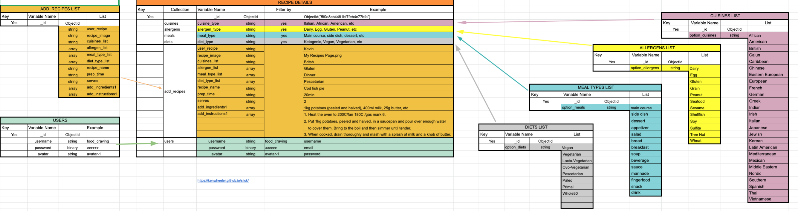

# My Cookbook
### [Heroku App](https://my-cookbook-milestone-project.herokuapp.com)
### [GitHub](https://github.com/Camila-Ribeiro/My-Cookbook_Milestone-Project)
 

 
My CookBook is a Milestone Project created for the "Data Centric Development" module of my FullStack Software Development Course offered by [Code Institute](https://codeinstitute.net/).
 
## Table of Contents
1. [**Project overview**](#project-overview)
2. [**UX**](#ux)
  - [**User Stories**](#user-stories)
  - [**Design**](#design)
    - [**Libraries**](#libraries)
    - [**Color Scheme**](#color-scheme)
    - [**Typography**](#typography)
  - [**Wireframes**](#wireframes)
 
3. [**Features**](#features)
   - [**Existing Features**](#existing-features)
   - [**Features Left to Implement**](#features-left-to-implemement)
 
3. [**Technologies Used**](#technologies-used)
 
4. [**Databases Used**](#databases-used)
   - [**API - Spoonacular**](#api-spoonacular)
   - [**MongoDB**](#mongoDB)
 
5. [**Testing**](#testing)
  - [**Validators**](#validators)
  - [**Automated Testing**](#automated-testing)
 
6. [**Deployment**](#deployment)
 
7. [**Credits**](#credits)
  - [**Content**](#content)
  - [**Media**](#media)
  - [**Acknowledgements**](#acknowledgements)
 
---
 
## Project overview
My Cookbook was built using [Python](https://www.python.org/) - programming language, [Flask](https://flask.palletsprojects.com/en/1.1.x/) - which is a Python micro framework and [MongoDB Atlas](https://www.mongodb.com/) - a document-based database.
 
 
## UX
 
My Cookbook is an online web application designed for users with interest in gathering information about recipes. The user can:
- Register an account
- Add their own recipe (by registered user)
- Edit,update and delete recipes (by registered user)
- Search recipes (by without an allergen)
- Search recipes (by diet)
- Search recipes (by cuisine)
- Search recipes (by meal type)
- View recipe details
 
The website is simple and structured in a way that is easy to navigate through and find recipes.
 
### User Stories
 
- As a user I want to search recipes filtered by allergen type, to perform this action I clicked on All recipes page, then I clicked on filter "Allergens", doing that I achieved my goal to see only recipes that were peanut free and I'm allergic to it.
 
- As a user I want to store my own recipes, to perform this action I registered into the website, then I clicked on "Add recipes", doing that I achieved my goal to store only recipes that were created by myself and have a list of my own recipes.
 
- As a user I want to edit my own recipes, to perform this action I logged into the website, then I clicked on "My recipes" and then on "Edit recipes", doing that I achieved my goal to edit and update recipes.
 
### Design
 
A standard layout is fully responsive on mobile devices and larger screens.
 
#### Libraries
 
- [Bootstrap 4](https://getbootstrap.com/) - is a framework for building responsive, mobile-first websites.
- [Icofont](https://icofont.com/) - is an icon font application that contains 2100+ icons in a single font.
- [jQuery](https://jquery.com/download/) - is a lightweight, "write less, do more", JavaScript library. The purpose of jQuery is to make it much easier to use JavaScript on your website.
- [Slick](https://kenwheeler.github.io/slick/) - is a responsive carousel jQuery plugin that supports multiple breakpoints, CSS3 transitions, touch events/swiping & much more!
- [Bootsrap Select](https://developer.snapappointments.com/bootstrap-select/) - is a jQuery plugin that brings select elements into the 21st century with intuitive multiselection, searching, and much more.
 
#### Color Scheme
 
- 
- 
- 
- 
- 
 
#### Typography
 
3 [Google Fonts](https://fonts.google.com/) were used across the site:
 - [Open Sans](https://fonts.google.com/specimen/OpenSans) : body text
 - [Lobster Two](https://fonts.google.com/specimen/LobsterTwo) : h1, h2, h3, h4, h5
 - [Montserrat](https://fonts.google.com/specimen/Montserrat) : h6
 
### Wireframes
 
My wireframes for this project can be found in the UX folder.
 
- [Desktop Wireframe](static/UX/My-cookbook-desktop-wireframe.pdf)
- [Mobile Wireframe](static/UX/My-cookbook-mobile-wireframe.pdf)
 
##### back to [top](#table-of-contents)
 
---
 
## Features
 
### Existing Features
- Index - this page the "Get Inspired" section displays a carousel with recipes from Spoonacular API and the user can get inspired flicking forward and backwards through cards. There are two additional sections, "Make your own Cookbook" (user logged in - where the user has a different path to add, edit and share their recipes) and "How this website works" (user not logged in - where guides the user which steps to take to use the website properly).

- All recipes - this page displays filters such as Cuisines, allergens, diet label and meal type where the user can filter the recipe they want to see according to the filter selected. There are also " Inspiration recipes" cards to see different options then the chosen ones using filters. If a user is logged in it will display "Recipes by User" where the user can see their own recipes already added.

- My recipes - this page displays the user profile card with the avatar chosen when registered, also the number of recipes the user has added. Beside it there are displayed recipe's cards that the user created, which has the options to view the recipe clicking on recipe's name, edit or delete.

- Add recipes - this page allows the user to add new recipes and all fields are required. The user can choose 1 option of cuisines, and multiple options (up to 4) of allergen, meals type and diet label. Add recipe name, recipe image, preparation time and number of servings. The ingredients and instructions fields have the feature to add more inputs. After all information inserted just click the "ADD recipe" button.

- Edit recipes - this page allows the user to edit their own recipes and all fields are required. The fields are filled already with information from the recipe addded, The user can then edit the desired fields. The user can choose 1 option of cuisines, and multiple options (up to 4) of allergen, meals type and diet label. Add recipe name, recipe image, preparation time and number of servings. The ingredients and instructions fields have the feature to add more inputs. After all information inserted just click the "ADD recipe" button.

- Recipe details - this page displays detailed information about recipes from the Spoonacular API. There is recipe image, preparation time, servings, diets type, meal type. The list of ingredients and equipments are displayed in images. There are instructions steps and also pairing wine section with wine options and a link where to buy it.

- User recipe details - this page displays detailed information about recipes added by the user using MongoDB to store it. There is recipe image, preparation time, servings, diets type, meal type, list of ingredients and instructions steps. It's also available the option to edit and delete the recipe.

- Log In - this page has two inputs, username and password. Underneath the submit button there is a link which redirects to the Register page in case the user is not already registered. The cancel icon redirects back to index.

- Register - this page has two inputs, username and enter password. The user can choose between two avatars and underneath the submit button there is a link which redirects to Log In page in case the user is already registered. The cancel icon redirects back to index.

- Error page - this page handles an error page in case the route wasn't found. There is a link to redirect the user back to index.
 
### Features Left to Implement
- Edit recipes - if user had already added image and does't want to edit, I would like the to keep the image instead the user have upload again.

##### back to [top](#table-of-contents)
 
---
 
## Technologies Used
 
 
<b>Built with</b>
 
1. 
 - [Bson](http://bsonspec.org/) - short for Bin­ary JSON, is a bin­ary-en­coded seri­al­iz­a­tion of JSON-like doc­u­ments.
2. 
 - [Chrome Developer Tools](https://developers.google.com/web/tools/chrome-devtools) - is a set of web developer tools built directly into the Google Chrome browser.
3. 
 - [CSS3](https://developer.mozilla.org/en-US/docs/Web/CSS/CSS3) - Used as the base for cascading styles.
4. 
 - [Flask](https://flask.palletsprojects.com/en/1.1.x/) - is a web framework, it provides you with tools, libraries and technologies that allow you to build a web application.
5. 
 - [Flask-Bcrypt](https://flask-bcrypt.readthedocs.io/en/latest/) - is a Flask extension that provides bcrypt hashing utilities for your application.
6. 
 - [Flask PyMongo](https://flask-pymongo.readthedocs.io/en/latest/) - Bridges between Flask and PyMongo.
7. 
 - [Flask Session](https://flask.palletsprojects.com/en/1.1.x/api/#flask.session) - Flask-Session is an extension for Flask that adds support for Server-side Session to your application.
8. 
 - [Flask WTF](https://flask-wtf.readthedocs.io/en/stable/) - Simple integration of Flask and WTForms, including CSRF, file upload, and reCAPTCHA.
9. 
 - [Git](https://git-scm.com/) - open source distributed version control system.
10. 
 - [GitHub](https://github.com/) - is a Web-based hosting service for version control using Git.
11. 
 - [GitIgnore](https://github.com/toptal/gitignore.io) - is a web service designed to help you create .gitignore files for your Git repositories.
12. 
 - [Heroku](https://dashboard.heroku.com/) - lets you deploy, run and manage applications written in Ruby, Node.js, Java, Python, Clojure, Scala, Go and PHP.
13. 
 - [HTML5](https://developer.mozilla.org/en-US/docs/Web/Guide/HTML/HTML5) - used as the base for markup text.
14. 
 - [jQuery](https://jquery.com/) - is a fast, small, and feature-rich JavaScript library. It makes things like HTML document traversal and manipulation, event handling, animation, and Ajax much simpler with an easy-to-use API that works across a multitude of browsers.
15. 
 - [Jinja2](https://jinja.palletsprojects.com/en/2.11.x/) - a full featured template engine for Python.
16. 
 - [MongoDB Atlas](https://www.mongodb.com/) - is a document database with the scalability and flexibility that you want with the querying and indexing that you need.
17. 
 - [Python](https://www.python.org/downloads/release/python-383/) - is a scripting language.
18. 
 - [PyMongo](https://docs.mongodb.com/drivers/pymongo) - is a MongoDB driver for Python used to access the MongoDB database.
19. 
 - [Werkzeug](https://werkzeug.palletsprojects.com/en/1.0.x/) - is a WSGI utility library for Python
20. 
 - [WTforms](https://pypi.org/project/WTForms/) - is  a framework agnostic library handling web forms in python.
 
##### back to [top](#table-of-contents)
 
---
## Databases Used
 
### API - Spoonacular
[Spoonacular](https://spoonacular.com/) Food API is a free recipe search API that provides recipes data from calling a API endpoint and receiving the data back as [JSON](https://www.json.org/json-en.html) format. This API has daily limit calls based on 150 quota points per day.
 
Using Python requests I populated the recipes displayed on:
 
- [index.html](https://my-cookbook-milestone-project.herokuapp.com/index) in the "Get Inspired" section
- all filters across the website
- [all-recipes.html](https://my-cookbook-milestone-project.herokuapp.com/all_recipes), populating cards accordingly with filter selected
- [recipes-details](https://my-cookbook-milestone-project.herokuapp.com/recipe_details)
 
### MongoDB
 
MongoDB is a highly scalable database server that stores data in a non-relational format and it's designed to store humongous amounts of data.
My MongoDB database consists of the following collections:
 
- add_recipes
- cuisines
- allergens
- diets
- meals
- users
 
I have also created a database schema:

 
##### back to [top](#table-of-contents)
 
---
 
## Testing
 
The project guidelines stated that a Test Driven Development (TDD) approach should be taken to developing the web application but I only manual testing was conducted during this project to fix bugs I used print() method. Below I outlined most of what I did below for documentation purposes.
I also have validated all files using online validation sites cited below and checked across different browsers and devices.
 
 
### Validators
 
#### HTML
 
- [W3C HTML Validator](https://validator.w3.org/) - `Text not allowed in elements in this context. - errors due to Jinja`
 
#### CSS
 
- [W3C CSS Validator](https://jigsaw.w3.org/css-validator/) - `Congratulations! No Error Found.`
 
#### PYTHON
 
- [W3C CSS Validator](http://pep8online.com/checkresult) - `minor errorsgit status`
 
#### JavaScript
 
 - [JShint](https://jshint.com/)
  - File: [main.js](static/js/main.js)
       - Metrics:
           - There are 12 functions in this file.
           - Function with the largest signature takes 2 arguments, while the median is 0.
           - Largest function has 15 statements in it, while the median is 2.
           - The most complex function has a cyclomatic complexity value of 1 while the median is 1.
 
 
### Manual Testing
I have conducted a detailed [manual testing](static/testing/manual/testing.md) to show that I have extensively tested this web application.
 
#### Testing Flask - Within my settings I had flask's debugger set to
 
`debug=True`
 
This is used for when Flask ever encounters an error the application knows to display this error in the view to give indication of what caused the app to crash.
 
I would work in small sprints where every step in my development I would ensure my app is still working as expected and where the app encounters any errors, I would debug the source until rectification was a success. Where needed I would document the error and the remediation taken in case of future occurrences.
 
Doing this meant after a while the error codes became more familiar to me. And from this debugging each error becomes less time consuming.
 
I have also created a testing matrix ([raw Excel file here](testing/manual/curious_world-testing-milestone.xlsx)).
 
##### back to [top](#table-of-contents)
 
---
 
## Deployment
 
[My CookBook](https://https://github.com/Camila-Ribeiro/My-Cookbook_Milestone-Project) was developed  locally using **VS Code**, and all commits were pushed to [**Heroku**](https://my-cookbook-milestone-project.herokuapp.com) using [**Git**](https://git-scm.com/).
 
In order to get the application ready for deployment I followed the next steps:
1. I removed all my hard-coded environment variables from app.py to protect my Database name, URI and secret-key and placed them in the env.py for development and entered it into herouku's Config Var for production.
2. On the terminal window using the command `pip3 freeze > requirements.txt` I installed `requirements.txt` file, which contains a list of items to be installed, defining the modules imported to Heroku.
3. Set up the Procfile (Remember to use a capital P in Procfile). using the command `echo web: python app.py > Procfile` - The Procfile file contains `web: python app.py` which tells Heroku to start a process called web and to run `python app.py` when it starts.
4. Created a new Heroku app
5. Created Config Var for production adding api_key, IP, PORT, MONGO_DBNAME, MONGO_URI & SECRET_KEY.
6. Set Flask's debugging to False.
7. Pushed the code to Heroku.
 
Upon successful deployment Heroku will give you the URL that is hosted on your app!
 
**IMPORTANT NOTE**:
 
- Please allow a few minutes to pass before opening your newly deployed link! Clicking this link too quickly may result in a failure to build the site, causing an Error 404 page instead.
 
Congratulations! Your project should be deployed successfully on Heroku's app! :tada:
 
##### back to [top](#table-of-contents)
 
---
 
## Credits
 
### Content
 
- [Spoonacular API](https://spoonacular.com/) - Database content
 
### Media
 
- [Spoonacular API](https://spoonacular.com/) - Database images
- [Unsplash](https://unsplash.com/) - Photo by Brook Lark
- [Freepik](https://freepik.com/) - Database images
 
### Acknowledgements
 
I received inspiration for this project from Code Institute - Project Ideas
 
##### back to [top](#table-of-contents)
 

